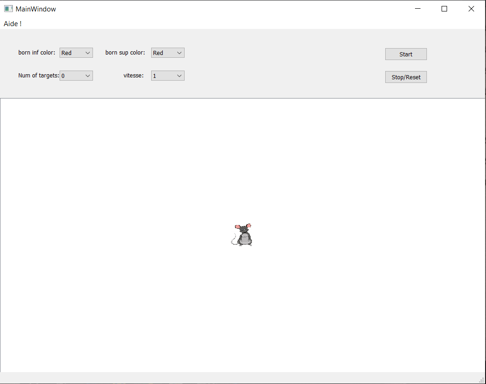

1.  **Introduction :**

Vision artificielle ou par ordinateur est une des branches de
l\'[intelligence
artificielle](https://fr.wikipedia.org/wiki/Intelligence_artificielle),
son but principale d'imiter l'œil humaine avec toutes ces
fonctionnalités de traitement et analyses des images capturées par la
camera dans notre cas.

Notre problème consiste à exploiter des différentes couleurs afin de
diriger une souris à travers un plan ou il devrait atteindre un ou
plusieurs buts éparpillés, cela en détectant 2 couleurs distinctes qui
forme une flèche début et fin.

2.  {width="6.161111111111111in"
    height="4.866666666666666in"}**Notre Application :**

Figure 1 : Vue initiale de notre interface.

> Sur notre interface, il existe 4 améliorations possibles :

-   La modification des couleurs des bornes de la flèche (Noir, Gris,
    Bleu, Rouge, Jaune).

> bounds = {
>
> \"red\": (\[17, 15, 100\], \[50, 56, 200\]),
>
> \"blue\": (\[86, 31, 4\], \[220, 88, 50\]),
>
> \"gray\": (\[103, 86, 65\], \[145, 133, 128\]),
>
> \"black\" : (\[1,1,1\], \[40,40,40\])
>
> }

-   Initialisation de vitesse initiale.

-   Variation des target/obstacle jusqu'au 10.

-   Implicitement, si une flèche reste sur le même angle, la vitesse
    augmente petite a petite.

a.  **Déterminer le centre des couleurs :**

> Après que l'utilisateur choisit ces couleurs de flèches qui sont par
> default :
>
> Born_inf = « Black » Born_sup = « Red »
>
> Et faire saisir le reste des paramètres, le lancement du jeu en
> cliquant sur le bouton « Start » est accompagné par la récupération
> des bordures supérieurs et inférieurs des couleurs choisit.
>
> Nous avons défini la fonction centroîde suivante :
>
> def centroid(frame, bounds):
>
> points = filtre(frame, bounds)
>
> x_coords = list()
>
> y_coords = list()
>
> for i in points:
>
> x_coords.append(i\[0\])
>
> y_coords.append(i\[1\])
>
> \_len = len(points)
>
> centroid_x = sum(x_coords)/\_len
>
> centroid_y = sum(y_coords)/\_len
>
> return \[round(centroid_x), round(centroid_y)\]
>
> Grace à l'algorithme filtre qui récupère les coordonnées (x, y) dont
> leur valeur dans la photo capturée par la cam est entre bordure
> inferieur et supérieur puis faire la somme des x et des y trouvés et
> les diviser sur le nombre des points afin de déterminer le centre
> d'une des deux couleurs, donc la fonction centroîde est exécuté 2 fois
> en total.
>
> def filtre(frame, bounds):
>
> l = list()
>
> lower = np.array(bounds\[0\], dtype = \"uint8\")
>
> upper = np.array(bounds\[1\], dtype = \"uint8\")
>
> size1 = len(frame)
>
> size2 = len(frame\[0\])
>
> for i in range(0, size1):
>
> for j in range(0, size2):
>
> if (frame\[i\]\[j\] \> lower).all() and (frame\[i\]\[j\] \<
> upper).all():
>
> l.append((i,j))
>
> return l

b.  **Détermination de la direction :**

> Après trouver les 2 centres des 2 couleurs introduites, on exploite
> les lois de translation de la géométrie pour déterminer de rayon avec
> lequel les coordonnées de notre souris seront transférés.
>
> def det_trans(og, new):
>
> return ( (og\[0\] - new\[0\]), (og\[1\] - new\[1\]) )
>
> Pour cela on calcule un 3éme centre (c3) entre les 2 centres (c1, c2)
> précédents, puis on détermine le rayon de translation entre c3 et le
> point O (0, 0) qui sensé être implicitement le point de vue de notre
> souris, ensuite on détermine les nouvelles coordonnées pour le centre
> de la couleur décisive de notre flèche (Born_sup), ces derniers sont
> notre direction avec laquelle notre souris va déplacer.
>
> def translation(ray, pt):
>
> return (pt\[0\] + ray\[0\], pt\[1\] + ray\[1\])
>
> C'est à cette niveau où on ajoute l'option d'ajustement automatique de
> vitesse en cas ou les coordonnées de direction reste inchangeable ou
> l'user change la vitesse initiale.

c.  **Comportement vs target et l'obstacle :**

> Cette tache a prouvé être plus ou moins délicate, vue que les matrices
> est case par case et donc indice par indice.
>
> La façon dont laquelle on a géré atteint d'un but est par une
> comparaison entre les coordonnées du but avec les coordonnées
> courantes de la souris, si l'intersection entre ses deux ensembles est
> positive donc on consomme le target sinon dans le cas d'un obstacle on
> revient au point départ et affichage de « Game over ».

d.  **Reset/Stop :**

> Ce bouton sert à mettre par default certaines paramètre de notre jeu,
> ainsi que la sauvegarde du fichier vidéo de la flèche lors de votre
> tour.
>
> def start(self):
>
> self.cap = cv2.VideoCapture(0)
>
> self.fourcc = cv2.VideoWriter_fourcc(\*\'XVID\')
>
> self.writer = cv2.VideoWriter(\'test.avi\', self.fourcc, 30.0,
> (640,480))
>
> error = QtWidgets.QErrorMessage()
>
> center1_1 = (0 , 0)
>
> while(self.cap.isOpened()):
>
> ret, frame = self.cap.read()
>
> frame = cv2.flip(frame, 1)
>
> center_1 = center_2 = center = (0, 0)
>
> try:
>
> center_1 = centroid(frame, bounds\[self.head.lower()\])
>
> center_2 = centroid(frame, bounds\[self.toe.lower()\])
>
> center = (round((center_1\[0\] + center_2\[0\]) / 2),
> round((center_1\[1\] + center_2\[1\]) / 2))
>
> except Exception as e:
>
> pass
>
> ray = det_trans((0, 0), center)
>
> center_11 = translation(ray, center_1)
>
> direction = (round(center_11\[0\] / (20 - self.pas)),
> round(center_11\[1\] / (20 - self.pas)))
>
> self.x_offset = self.x_offset + direction\[1\]
>
> self.y_offset = self.y_offset + direction\[0\]
>
> self.mousepos = \[(self.x_offset + i, self.y_offset + j) for i in
> range(52) for j in range(52)\]
>
> self.graphicsPixmapItem.setPos(self.x_offset, self.y_offset)
>
> for fermaga in self.targets.keys():
>
> x = fermaga\[0\]
>
> y = fermaga\[1\]
>
> d = 0
>
> coins = \[(x, y), (x + 52, y), (x , y + 52), ( x + 52, y + 52)\]
>
> for i in self.mousepos:
>
> if i in coins:
>
> self.graphicsScene.removeItem(self.targets\[fermaga\])
>
> self.targets.pop(fermaga)
>
> d = 1
>
> break
>
> if d == 1:
>
> break
>
> for fermagapoop in self.Obstacles.keys():
>
> x = fermagapoop\[0\]
>
> y = fermagapoop\[1\]
>
> d = 0
>
> coins = \[(x, y), (x + 52, y), (x , y + 52), ( x + 52, y + 52)\]
>
> for i in self.mousepos:
>
> if i in coins:
>
> self.graphicsScene.removeItem(self.graphicsPixmapItem)
>
> self.graphicsPixmapItem.setPos(0, 0)
>
> self.graphicsScene.addItem(self.graphicsPixmapItem)
>
> self.x_offset = 0
>
> self.y_offset = 0
>
> d = 1
>
> cv2.imshow(\"gameover\", game)
>
> break
>
> if d == 1:
>
> break
>
> if ret==True:
>
> cv2.imshow(\"camera\", frame)
>
> self.writer.write(frame)
>
> if cv2.waitKey(1) & 0xFF == ord(\'q\'):
>
> break
>
> else:
>
> break
>
> try:
>
> pass
>
> except Exception as e:
>
> raise e

3.  **Conclusion :**

Ce jeu est tellement loin d'être finis si on considère les nouvelles
découvertes, frameworks, algorithmes dans le domaine de vision
informatique, qui permet encore de surtouts optimiser notre code mais
aussi pour le rendre beaucoup plus flexible et variant.
